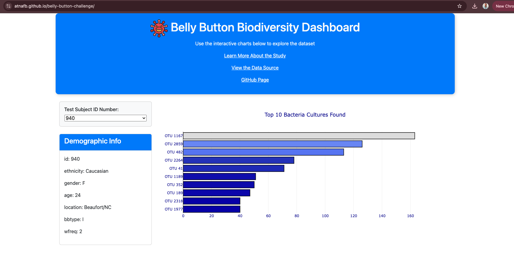

# Belly Button Biodiversity Dashboard

## Background

This project builds an interactive dashboard to explore the [Belly Button Biodiversity dataset](https://robdunnlab.com/projects/belly-button-biodiversity/), which catalogs the microbes that colonize human navels.

The [dataset](https://static.bc-edx.com/data/dl-1-2/m14/lms/starter/samples.json) reveals that a small handful of microbial species (also called operational taxonomic units, or OTUs) were present in more than 70% of people, while the rest were relatively rare.

## Project Overview

This project involves:

- Creating an interactive dashboard using D3.js and Plotly.js.
- Visualizing the dataset with a bar chart, bubble chart, and metadata panel.
- Updating all visualizations dynamically based on user selection.
- Deploying the dashboard using GitHub Pages.
- 
## Screenshot

  
## Steps to Complete the Project

### 1. Data Retrieval
- Use the D3 library to fetch the dataset from [this JSON URL](https://static.bc-edx.com/data/dl-1-2/m14/lms/starter/samples.json).
- Store the data and use it for building visualizations.

### 2. Horizontal Bar Chart
- Create a bar chart with a dropdown menu to display the top 10 OTUs found in the selected individual.

### 3. Bubble Chart
- Build a bubble chart to display all OTUs.
  
### 4. Metadata Panel
- Display demographic information about the selected individual.
- Extract and loop through key-value pairs from the metadata JSON object.
- Append the information to the sample-metadata panel.

### 5. Dashboard Interactivity
- Update all plots when a new sample is selected from the dropdown.

## Deployment

The project is deployed using **GitHub Pages**:

- Visit the live dashboard at: **[CLICK HERE](https://atnafb.github.io/belly-button-challenge/)**
